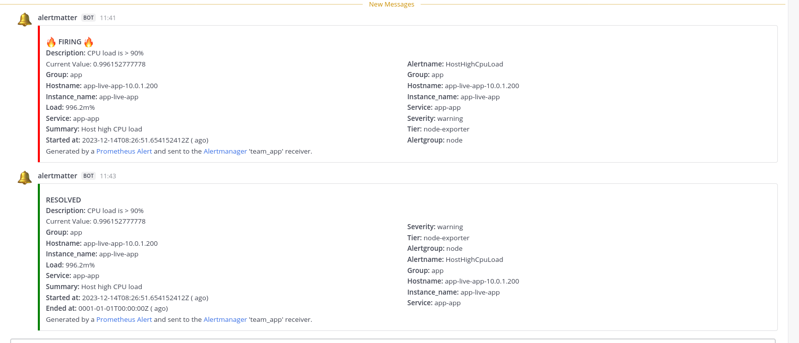

<a href="https://zerodha.tech"></a>

# alertmatter

_Alertmanager - Mattermost Webhook Receiver_

## Overview

This project provides a service that acts as a bridge between Alertmanager and Mattermost. It receives alerts from Prometheus' Alertmanager and forwards them to a specified Mattermost channel via webhooks. This service is ideal for teams using Mattermost for communication and needing real-time alert notifications from their monitoring systems.

## Quickstart

### Binary

Grab the latest release from [Releases](https://github.com/mr-karan/alertmatter/releases).

### Docker

You can find the list of docker images [here](https://github.com/mr-karan/alertmatter/pkgs/container/alertmatter)

```
docker pull ghcr.io/mr-karan/alertmatter:latest
```

## Usage
To start the service, use the following command:

```bash
./bin/alertmanager-mattermost.bin --addr=0.0.0.0:7777 --webhook-url=https://mattermost.corp.internal/hooks/johndoe
```

### Parameters
- `--addr`: The address and port on which the service will listen for incoming Alertmanager notifications.
- `--webhook-url`: The Mattermost incoming webhook URL to which the alerts will be sent.

## Alertmanager Configuration

Configure Alertmanager to send alerts to this service. Add a webhook receiver in your `alertmanager.yml`:

```yaml
receivers:
- name: 'mattermost-webhook'
  webhook_configs:
  - url: 'http://<your-service-address>:7777/alert?channel=<channel-name>'
```

Replace `<your-service-address>` with the address where your service is running and `<channel-name>` with the name of channel to post the alert to.

## Example

```bash
curl -X POST -H "Content-Type: application/json" -d @samples/firing.json http://localhost:7777/alert\?channel\=production-alerts
```



## Contributing

Contributions to this project are welcome. Please submit issues and pull requests on the repository page.
